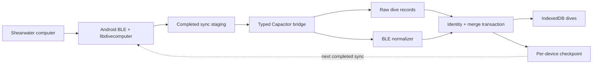

# Shearwater BLE Import (Parked)

> **Status:** Design direction reviewed; **do not implement** until explicitly
> requested. The research and identity gates below remain open. Finish the
> applicable PRODUCT-SPEC readiness work first.

## Goal

On Android, download dive logs over BLE from supported Shearwater computers
directly into DiveFrame, without requiring Shearwater Cloud or Subsurface as a
middle step.

Capture the complete raw record returned by the computer as well as every field
the first normalizer understands. This allows later parser improvements to
recover fields without requiring the user to download the dive again. Normalize
depth and temperature profiles, gas and pressure information, dive metadata,
and explicit GPS coordinates when the computer and libdivecomputer provide
them. Skip or safely merge dives already in the logbook.

GPS must not be promised for models that do not record it. Do not infer a dive
site from the phone's location as part of this feature.

## Decisions locked

- **Platform:** Capacitor native shell; Android first; iOS only if demand
  justifies it later.
- **Protocol:** Use
  [libdivecomputer](https://libdivecomputer.org/) rather than reimplementing
  Shearwater framing or dive parsing.
- **Read-only native API:** Scan, connect, identify, download, and cancel only.
  Do not expose settings, clock, firmware, or generic write operations to the
  JavaScript bridge.
- **Foreground v1:** A sync runs only while the app is open. Safe cancellation
  and lifecycle interruption are required; background continuation and a
  foreground service are not v1 requirements.
- **Lossless capture:** Retain the raw bytes for each downloaded dive together
  with parser provenance.
- **Data path:** Native download and staging → JavaScript data contract →
  normalization → the existing identity/merge pipeline, extended only where
  required for raw records, checkpoints, and outcome counts.
- **No checkpoint without commit:** A libdivecomputer fingerprint advances only
  after the entire completed sync has been normalized and committed locally.

## Device scope

The intended first family is Shearwater computers supported by
libdivecomputer's Petrel-family BLE backend. Candidate hardware includes Perdix,
Perdix 2/AI, Teric, Peregrine variants, and Tern variants.

Do not advertise a model as supported merely because it exposes a known GATT
service. The research spike must produce a compatibility matrix recording:

- exact model and firmware;
- libdivecomputer version/commit and descriptor selected;
- discovery, pairing, reconnect, download, fingerprint, and cancel results;
- fields actually returned, including profile interval, gases, transmitter
  pressures, and GPS; and
- known Android-version or handset-specific behavior.

Perdix 3, untested Shearwater models, Bluetooth Classic transports, and other
brands remain out of scope until separately validated. In product copy, avoid
using “classic Shearwater” to describe a BLE transport because it is easily
confused with Bluetooth Classic.

## Why not PWA-only Web Bluetooth

Web Bluetooth can be useful for an isolated Android Chrome research comparison,
but it is not the planned release architecture. The product path is a
Capacitor shell with a native Android plugin and libdivecomputer so transport,
pairing, cancellation, lifecycle handling, and a possible later iOS
implementation have a controlled native boundary.

## Product surfaces and portability

The public web app remains the easiest onboarding path and a first-class
DiveFrame product. The native app adds capabilities that browsers cannot offer
reliably; it must not become a separate logbook implementation.

- Build the web app and Capacitor app from the same application code, normalized
  dive model, IndexedDB schema, migrations, backup format, merge rules, and
  translations.
- Put native-only features such as BLE behind capability adapters. Their absence
  must not change the shape or meaning of an imported dive.
- Every normalized BLE dive must remain fully usable in the web app: logbook,
  edits, photos, charts, composer, exports, backup, and duplicate review.
- The web app must preserve, validate, back up, restore, and re-export raw BLE
  records and checkpoints even though it cannot initiate a native BLE download.
  Moving a backup app → web → app must not silently discard app-only data.
- The website and a Capacitor installation have separate browser storage
  origins; installing the app does not automatically expose the website's
  IndexedDB or vice versa. Portable backup/restore is the first transfer path.
- A possible future Google Drive feature should be an app-only transport over
  the same versioned backup/snapshot and merge semantics, not a second database
  model or a native-only dive format.
- Schema and backup-format compatibility must be versioned so an older web
  deployment fails clearly on unsupported future data rather than partially
  importing it.

## Future account and hosted-sync readiness

Accounts and DiveFrame-hosted storage are explicitly **not part of the initial
BLE or native-app release**. Anonymous local use must remain fully functional
without registration, a network connection, or a subscription. The architecture
should nevertheless leave a clean seam for a user to create an account later,
attach the current local logbook, and recover records and eligible settings
after signing in on another web or native installation.

### Architectural boundary to preserve now

- Keep IndexedDB as the local working database in both web and native builds.
  A future account service synchronizes with it; screens must not read directly
  from a remote API.
- Keep stable domain IDs independent of an account ID, device ID, database
  primary key, or server URL. Scope records to an account in the future server
  database rather than changing canonical dive IDs.
- Maintain one canonical serialization/validation layer for records. Portable
  backups, Google Drive snapshots, and a future hosted sync service may use
  different transports, but must not invent different dive or settings shapes.
- Keep transport adapters replaceable: local-only, file backup, Google Drive,
  and DiveFrame account sync should sit above the same repository and merge
  APIs.
- Do not put authentication tokens, provider credentials, encryption keys, or
  passwords in IndexedDB records, portable backups, or syncable settings.
  Native secrets belong in platform secure storage; web sessions need an
  appropriate secure authentication design.
- Capability checks, not account checks, control BLE. A signed-out native user
  must still be able to download and use dives locally.

### Record readiness

Before hosted sync is implemented, every syncable record type should have:

- an immutable stable ID and explicit schema version;
- creation and modification metadata with defined clock semantics;
- validation independent of UI components;
- deterministic serialization;
- a documented merge/conflict rule; and
- a deletion representation or tombstone so deletion can propagate instead of
  silently resurrecting on another device.

Do not add speculative per-field sync machinery to the BLE milestone. When a
schema is next revised, however, avoid choices that make the metadata above
impossible. The present backup rule—an incoming complete record replaces a
matching local record—is suitable for explicit backup restore but is not by
itself a sufficient concurrent multi-device sync policy. Hosted sync will need
an explicit revision/change-feed and conflict design.

### Data classification

| Class | Examples | Future account behavior |
|---|---|---|
| Core user records | dives, source provenance, site choices, composer settings and presets | Sync by default |
| Potentially large/private data | photos, backgrounds, logo, raw BLE records, profiles | Supported by the shared model, but upload policy, quotas, and user controls must be decided before launch |
| Portable preferences | language, units, default cylinder, composer defaults | Sync selectively with documented conflict behavior |
| Device-local state | transient UI state, permission state, active BLE connection | Never sync |
| Recovery/checkpoint state | BLE computer association and fingerprint | Sync or back up only with its associated dives/raw records; never let it suppress records absent from the destination |
| Secrets | sessions, OAuth refresh tokens, encryption keys | Never enter normal app data or backups |

Content hashes for large immutable blobs should remain an available future
optimization so object storage can avoid retransmitting identical media. Do not
make the main record ID depend on a particular storage provider.

### Later account attachment and recovery flow

When accounts are eventually designed:

1. A user can continue locally or choose **Sign in / create account**.
2. Existing local data is inventoried and previewed before attachment.
3. The user chooses a clearly explained merge/upload action; account data must
   not silently replace local records.
4. A second installation downloads and validates account records into its local
   database, then uses the same merge and duplicate-review behavior as other
   imports.
5. Signing out must explicitly offer to keep or remove the local copy.
6. Export and account deletion must remain available independently of the
   service continuing to operate.

A future hosted service may use incremental records/change feeds rather than
uploading the complete JSON backup on every edit. It should still reuse the
same record codecs and semantics, with the portable backup remaining the
provider-independent escape hatch.

### Deferred security and cost gate

Do not ship account functionality until there is a separate reviewed design
covering authentication provider choice, account recovery, tenant isolation,
authorization rules, TLS, encryption at rest, abuse/rate controls, audit and
incident handling, data export/deletion, privacy terms, retention, backups,
media quotas, and sustainable storage/egress costs. Prefer a mature managed
identity provider over storing passwords directly.

## Architecture

The native side owns BLE I/O, libdivecomputer callbacks, threading, and
cancellation. The JavaScript bridge returns typed records and structured error
codes; it must not expose pointers or a generic byte-write API.

### Reuse

- [`lib/indexed-db.ts`](../../../lib/indexed-db.ts) — `LocalImportedDive`,
  transactional persistence, merge behavior, and richer-sample selection
- [`lib/dive-identity.ts`](../../../lib/dive-identity.ts) and
  [`lib/dive-matching.ts`](../../../lib/dive-matching.ts) — canonical identity
  and conservative cross-source matching
- [`app/DiveFrameApp.tsx`](../../../app/DiveFrameApp.tsx) — entry point beside
  **Import log** and refresh behavior

### New when unblocked

- Capacitor Android project and a small Android/JNI/NDK integration around
  libdivecomputer
- native scan, connection, download, progress, and cancellation state machine
- typed Capacitor bridge and BLE normalizer
- raw-dive and per-device-checkpoint persistence
- import outcome reporting
- recorded, privacy-scrubbed native fixtures and a real-device compatibility
  matrix
- user-guide BLE section and dependency/license notices

## Capture contract

The research spike must inventory libdivecomputer output before the permanent
JavaScript contract or normalized schema is finalized. At minimum, inspect and
preserve:

- device descriptor/backend, model, firmware where available, and serial;
- per-dive raw bytes and per-dive fingerprint/identifier where available;
- dive number, local device date/time, duration, mode, maximum/average depth,
  and temperature extrema;
- profile samples with original time resolution;
- temperature, pressure, transmitter/sensor index, gas switch, gas mix,
  decompression/NDL, event, and ppO2 information when present;
- cylinder association, volume, working pressure, and start/end pressure when
  present; and
- explicit GPS fields when present.

Do not silently discard fields merely because `LocalImportedDive` cannot yet
represent them. Store the raw record and document every deliberate omission
from the v1 normalized model. Preserve device-local date/time semantics; do not
invent a UTC offset. Test matching across phone timezones and daylight-saving
changes.

Each raw record needs enough provenance to reparse deterministically:

- stable record key linked to the canonical dive;
- device identity and libdivecomputer descriptor;
- libdivecomputer version/commit;
- parser/data-contract version;
- capture timestamp; and
- exact raw bytes plus their content length or checksum.

## Storage and performance budget

Raw records are expected to be small relative to photos and expanded JSON
profiles. As a reference measurement, the current 189-dive Shearwater Cloud
database is about 2.46 MiB, and its four `log_data.data_bytes_*` columns total
900,698 bytes: about 4.7 KiB per dive on average, with an observed maximum of
about 8.6 KiB. This is evidence for the current fixture, not a limit for every
model or log format.

Lossless retention must be implemented as cold source data:

- Store the raw payload once as `Blob`/binary data in IndexedDB, preferably in
  the representation received from the computer. Do not Base64-encode it for
  normal local storage.
- Parse and normalize once during import. Do not reparse every raw record during
  startup, logbook listing, filtering, or chart rendering.
- Keep list views on compact dive summaries and load profile samples only when a
  selected dive or export needs them. The current `LocalDive` record embeds its
  sample array, so the performance spike must test whether profiles should move
  to a separate IndexedDB store shared by both web and native builds.
- Do not retain multiple equivalent decoded copies. The normalized model and one
  raw source record are sufficient unless a measured recovery need proves
  otherwise.
- Base64 expansion is acceptable only when producing the portable JSON backup;
  account for its approximately one-third size overhead in the existing backup
  estimate and warnings.
- Measure download, normalization, IndexedDB commit, initial logbook render, and
  backup export separately with 200, 1,000, and a long-profile stress fixture.
  Optimize the measured bottleneck rather than dropping the recoverable source
  bytes preemptively.

## Identity and deduplication gate

This gate must pass before product UX work begins.

1. **Checkpoint identity:** Store libdivecomputer's opaque fingerprint with the
   libdivecomputer device type/descriptor and normalized computer serial, as
   recommended by libdivecomputer. Do not key it only by BLE MAC address, device
   display name, or serial alone.
2. **Per-dive identity:** Determine from real paired samples whether a stable
   per-dive fingerprint or identifier is available. Never use download order as
   identity; do not rely on dive number alone.
3. **Cross-transport identity:** Import the same dives through BLE and a
   Shearwater Cloud database and compare serial representation, dive number,
   timestamp semantics, depth, duration, and any identifiers. BLE and Cloud are
   two transports for the logical Shearwater source, but their source IDs may
   not be equal.
4. **Deterministic merge:** Import BLE first and Cloud first in separate clean
   databases. Both orders must produce one canonical dive with both provenance
   records, without losing user edits, photos, site choices, or composer
   settings.
5. **Ambiguity:** If matching produces more than one plausible dive, retain the
   records separately and send them through the existing duplicate-review flow.
   Do not silently choose.

The current `DiveSource` value `"shearwater"` does not distinguish Cloud
database records from BLE records, and the current Shearwater database
`sourceId` may not match a libdivecomputer identifier. The implementation plan
must explicitly separate logical source from transport/provenance before
assuming the existing source mapping is sufficient.

## Checkpoint and transaction rules

libdivecomputer fingerprints are download checkpoints, not proof that DiveFrame
successfully stored every returned dive.

- Stage a completed enumeration before committing it.
- Commit normalized dives, source/provenance mappings, raw records, and the new
  checkpoint as one logical transaction.
- On permission denial, connection loss, cancellation, parse failure, storage
  failure, or app termination, do not advance the checkpoint.
- Decide explicitly whether a failed sync stores nothing or stores an
  identifiable partial batch. V1 should prefer an all-or-nothing batch unless
  real-device limits make that impractical.
- Provide **Download all again / reset sync history** per computer for recovery.
- A normal repeated sync with no new dives must be safe and report zero changes.

`upsertLocalDives()` currently does not persist raw records or checkpoints and
does not return new/updated/skipped counts. A scoped transactional extension is
therefore expected; “reuse the existing pipeline” does not mean no persistence
change.

## Local persistence, backup, and erase behavior

New durable stores must participate in the same coverage invariant as existing
user data.

| Data | Full backup / replace | Erase dive data only | Erase all data |
|---|---|---|---|
| Raw downloaded dive records | Include | Clear | Clear |
| BLE source/provenance mappings | Include | Clear | Clear |
| Per-device download checkpoints | Include | Clear, so dives can be downloaded again | Clear |
| Non-sensitive compatibility/help state | Decide explicitly | May retain | Clear if user-specific |

Also include raw-record bytes in backup-size estimates, integrity validation,
and storage-management reporting. Define migration behavior for older backups
that lack these stores. A restored checkpoint is valid only with the associated
restored dive/raw records; avoid creating a state that skips dives which are not
actually present locally.

## UX (Android app)

- Show **Download from computer** only when the native capability is available.
  In the browser PWA, a short explanation may replace or omit the action.
- Guide the user through: Bluetooth on → computer in transfer mode → scan →
  choose identified device → connect → download → save → summary.
- Show distinct progress states for scanning, connecting, reading device info,
  downloading, processing, and saving. Byte or dive counts may be indeterminate
  when the protocol cannot provide a total.
- Cancellation must say whether anything was saved. Under the preferred atomic
  model, cancellation saves no new batch and does not advance the checkpoint.
- Summarize new, updated, unchanged/skipped, ambiguous, and failed records.
- Include pairing and reconnect help, including a computer still connected to
  another phone.
- Explain that GPS may be absent because most supported computers do not supply
  a dive-site position.
- Allow the user to forget a computer/reset its checkpoint without deleting
  already imported dives, and to download all dives again.

## Android permissions and lifecycle

- On Android 12+ request only `BLUETOOTH_SCAN` and `BLUETOOTH_CONNECT` for v1;
  do not request advertise permission.
- Decide the minimum supported Android version during the Capacitor spike.
  Account for the older Android location-permission rules or evaluate Companion
  Device Manager for initial association.
- Do not request location permission on Android 12+ merely because the imported
  dive record might contain GPS; receiving stored dive data is not phone
  location scanning.
- Handle Bluetooth unavailable/off, permission denial, permission revocation,
  app backgrounding, WebView reload, process death, and the computer leaving
  transfer mode.
- Keep v1 foreground-only. If background continuation is later added, design
  the foreground-service notification and newer Android restrictions as a
  separate milestone.

## Security, privacy, and licensing

- Treat downloaded logs, device identifiers, raw records, and GPS as private
  local user data covered by backup, erase, and privacy documentation.
- Filter scan results through validated libdivecomputer descriptors/services
  and display enough device identity for the user to choose safely.
- Validate all native lengths and enum values before crossing the bridge.
- Pin an exact libdivecomputer release or commit and verify its Android support
  and API version during the spike. Version 0.9 introduced incompatible parser
  API changes, so examples for older releases must not be copied blindly.
- Before distribution, document the exact libdivecomputer license version,
  native linking method, copyright notices, source/relinking obligations, and
  any other bundled native dependencies. “LGPL is compatible” is not by itself
  a release checklist.

## Test and failure matrix

Automated tests should cover:

- native state-machine behavior with recorded/mock transport data;
- normalizer fixtures for every supported log format/profile interval;
- raw-record round trip and deterministic reparsing;
- first sync, no-op resync, interrupted sync, corrupt dive, and checkpoint
  reset;
- BLE-first and Cloud-first identity;
- two similar dives close in time without a false merge;
- atomic failure when IndexedDB quota or validation fails;
- backup merge/replace, legacy backup migration, and both erase scopes; and
- native → web → native backup round trips that preserve raw records,
  checkpoints, provenance, edits, and normalized dives;
- identical logbook behavior for file-imported and BLE-imported dives in the web
  and native builds; and
- serialization that does not bake account, device, or storage-provider IDs into
  canonical dive identity; and
- permission denied/revoked, Bluetooth off, connection loss, cancellation,
  app backgrounding, and process recreation.

Hardware acceptance requires at least one real Android phone and real computer
for every model/firmware combination advertised as supported. Recorded fixtures
may supplement but not replace hardware testing.

## Out of scope for v1

- iOS shipping
- models not validated in the compatibility matrix, including Perdix 3 until
  tested
- Bluetooth Classic transports
- Suunto, Garmin, and other brands
- phone-location capture or automatic site assignment
- replacing Shearwater Cloud backup
- computer settings, clock synchronization, firmware, or other write commands
- background sync
- Google Drive or other cloud synchronization; a later implementation must
  reuse the portable snapshot and merge contract
- accounts, hosted storage, and multi-device online sync; these require the
  separate security, conflict, privacy, and cost gate above
- safety-critical calculations or dive-computer management

## Implementation phases (only after explicit unblock)

1. **Transport and capture spike:** Pin libdivecomputer; build the smallest
   Capacitor/Android/JNI path; connect to one real computer; capture device info,
   one complete raw dive, callbacks, and a fingerprint; record field coverage.
2. **Identity spike:** Capture the same dives through BLE and Shearwater Cloud;
   settle source/provenance IDs, date/time handling, compatibility scope, and
   deterministic merge tests.
3. **Persistence design:** Finalize raw-record and checkpoint schemas, atomic
   commit behavior, backup/erase/migration rules, import outcome counts, and the
   account-readiness invariants without implementing accounts.
4. **Normalizer:** Map the approved v1 field inventory into
   `LocalImportedDive`, retain unmodeled raw data, and add fixture tests.
5. **Product UX:** Add permissions, scan/device choice, progress, cancellation,
   recovery controls, summary, pairing help, and translations.
6. **Hardening and release:** Run the failure/device matrix, complete privacy
   and LGPL compliance work, and update USER-GUIDE and PRODUCT-SPEC.
7. **Later if justified:** iOS, additional Shearwater backends/models, other
   brands, or background sync through the same high-level bridge contract.

## Prerequisites before unblock

- Applicable PRODUCT-SPEC backup trust and identity/merge work is stable.
- A real candidate Shearwater computer and Android device are available for
  milestones 1 and 2.
- The user has dogfooded file imports enough to settle which normalized fields
  are valuable; the raw-capture requirement remains regardless.
- While DiveFrame still has one user, pre-release schema work may deliberately
  require clearing or re-importing local records instead of carrying expensive
  compatibility code. Record any such reset clearly. Before inviting other
  users or offering accounts, establish supported migrations and stop treating
  destructive resets as routine.
- The implementation is explicitly authorized.

## Reference material for implementation

- [libdivecomputer overview and supported platforms/transports](https://libdivecomputer.org/)
- [libdivecomputer manual: fingerprints and device events](https://www.libdivecomputer.org/manual.html)
- [libdivecomputer 0.9 release notes](https://libdivecomputer.org/mailman3/hyperkitty/list/devel%40libdivecomputer.org/message/3F2BE2Q3XGIDF5ZP6FCAPHF3XTYLDFXT/)
- [Android Bluetooth permissions](https://developer.android.com/develop/connectivity/bluetooth/bt-permissions)
- [Android companion-device pairing](https://developer.android.com/develop/connectivity/bluetooth/companion-device-pairing)

## Docs to update when implementing

- [`PRODUCT-SPEC.md`](../../PRODUCT-SPEC.md) — move direct BLE import from a
  non-goal to the scoped Android milestone, with privacy/storage implications
- [`USER-GUIDE.md`](../../USER-GUIDE.md) — permissions, supported-device matrix,
  download/recovery flow, pairing tips, GPS limitations, and troubleshooting
- backup format/migration documentation — raw records and per-device
  checkpoints
- future account/sync design — record revisions, tombstones, conflicts,
  ownership, authentication, privacy, quotas, and provider-independent export
- dependency and asset notices — libdivecomputer and native transitive
  dependencies
